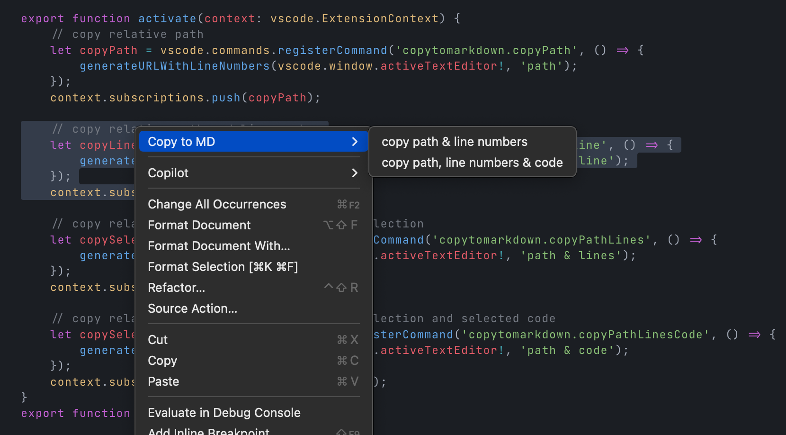
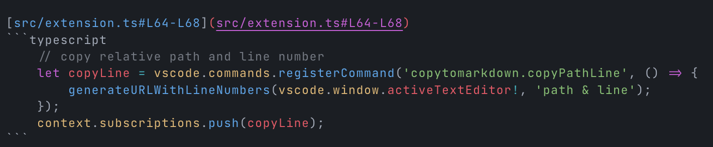

# Copy to Markdown

> Never spend 6 minutes doing something by hand  
> when you can spend 6 hours failing to automate it.  
> *the internet*


## Usage

In every file of your project, you can use the context menu to copy 
- the path of the file 
- the path of the file including the line number

or, if you have selected some text, you can copy

- the path of the file including the line numbers of beginning and the end of the selection
- include the selected text
to the clipboard, formatted as Markdown.

The context menu changes depending on if you have selected some text or not.


## Screenshots

### copy


### paste


## Installation

### via `.vsix` file

Download the `copy-to-markdown-0.1.0.vsix` file from this repository   
and install it from the command line with

```bash
code --install-extension copy-to-markdown-0.1.0.vsix
```

or from within VS Code with

```
Ctrl+Shift+P > Extensions: Install from VSIX...
```


### From the Marketplace
not yet ...  

## License
[MIT](LICENSE.md#L1), of course 😎  

## Credits
- https://code.visualstudio.com/api
- https://chat.openai.com/

### Disclaimer
This was my first VS Code extension, so please be kind 😇


 